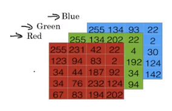
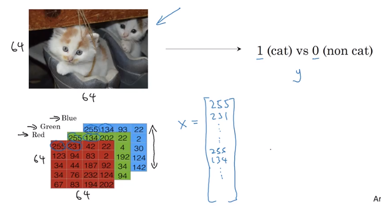
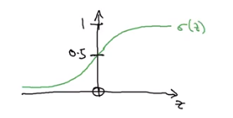

# Logistic Regression<!-- TOC depthFrom:1 depthTo:6 withLinks:1 updateOnSave:1 orderedList:0 -->

- [Logistic Regression](#logistic-regression)
	- [Example of binary classification:](#example-of-binary-classification)
		- [Notations](#notations)
		- [Training example:](#training-example)
		- [Training Set:](#training-set)
	- [Logistic regression](#logistic-regression)
		- [Notation:](#notation)

<!-- /TOC -->

Logistic regression is an algorithm for binary classification. Logistic regression transforms its output using the sigmoid function to return a probability value between 0 and 1.

## Example of binary classification:

Recognize above image 1 or 0 (non cat)



To turn these pixel intensity values into a feature vector, what we're going to do is unroll all of these pixel values into an input feature vector x.



 If this image is a 64 by 64 image, the total dimension of this vector x will be 64 by 64 by 3 because that's the total numbers we have in all of these matrixes. Which in this case, turns out to be 12,288, that's what you get if you multiply all those numbers. And so we're going to use nx=12288 to represent the dimension of the input features x.

### Notations

### Training example:
   - A single training example is represented by a pair, (x,y) where x is an x-dimensional feature vector and y, the label, is either 0 or 1.
   - $(x,y)$ where $x \in\mathbb{R}^{n_x}$, $y \in \{0,1\}$
### Training Set:
   - m training example: $\{(x^{(1),y^{(1)}})...,(x^{(m),y^{(m)}})\}$
   - Sometimes to emphasize the number of m training samples, you can write it as
     - $m=m_{train}  m_{test}=$ number of test samples
*  To output all of the training examples into a more compact notation, we're going to define a matrix, capital X
  - $X=\begin{bmatrix}
      |&|&|&|\\[0.3em]
       X^{(1)}&X^{(2)}&...&X^{(m)}\\[0.3em]
        |&|&|&|
     \end{bmatrix}$

     This will have $m$ columns,and height will be $n_x$

     $x \in\mathbb{R}^{n_x*m}$
     x has $n_x*m$ dimension

     * Python command to find out the dimension

     ``` python
     x.shape()
     ```

 - $Y=[y^{(1)},y^{(2)}, ... , y^{(m)}]$
 - so $Y \in \mathbb{R}^{1*m}$
 - in python, it can be represented as
   ```python
   Y.shape =(1,m)
   ```
## Logistic regression

* Given x, want $\hat{y}=P(y=1|x)$
* If X is a picture, you want $\hat{y}$ to tell you, what is the chance that this is a cat picture.
* X is an X dimensional vector, given that the parameters of logistic regression will be W which is also an X dimensional vector, together with b which is just a real number
* $x\in\mathbb{r}^{n*x}$
* Parameters: $w \in \mathbb{r}^{n*x}$, $b \in \mathbb{r}$
* Output $\hat{y}$
  - Given parameters, how to generate output?

  - In linear regression, you would say $\hat{y}= w^T + b$, but this is not a good algorithm for finding classification, because we want  $\hat{y}$ to be a probability between 0 and 1. $w^T + b$ would produce much bigger numbers.

  - so adding a sigmoid function to the output $\hat{y}= \sigma(w^T + b)$
  
* sigmoid curve


### Notation:

$z= (w^T + b)$

Sigmoid function can be written as

$\sigma(x) = \frac{1}{1+e^{-z}}$

* So if z is large,  $e^{-z}$ will be close to 0, so $\sigma(x) \approx \frac{1}{1+0}$
and if z is large negative, then $e^{-z}$ will be a big number, so  $\sigma(x) \approx \frac{1}{1+big_number} \approx 0$

* The training job is to try to learn parameters W and B so that  $\hat{y}$ becomes a good estimate of the chance of Y being equal to one.

* When we programmed neural networks, we'll usually keep the parameter $w$ and parameter $b$ separate, where here, $b$ corresponds to an inter-spectrum.
* In some conventions, you define an extra feature called $X_0=1$,where $X \in \mathbb{r}^{n_X+1}$ and $\hat{y} = \sigma(\theta^TX)$

$\theta=\begin{bmatrix}
\theta_0 \\[0.3em]
\theta_1 \\[0.3em]
\theta_2 \\[0.3em]
.\\[0.3em]
.\\[0.3em]
.\\[0.3em]
\theta_{R_x} \\[0.3em]
\end{bmatrix}$

$\theta_0$ is and the rest are $w$
