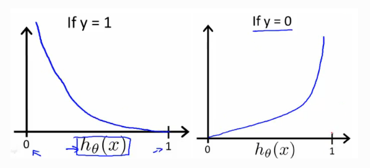

# Logistic Regression Cost Function

<!-- TOC depthFrom:1 depthTo:6 withLinks:1 updateOnSave:1 orderedList:0 -->

- [Logistic Regression Cost Function](#logistic-regression-cost-function)
	- [logistic Regression](#logistic-regression)
	- [Loss (error) function:](#loss-error-function)
	- [Cost function](#cost-function)

<!-- /TOC -->

## Logistic Regression
$\hat{y}= \sigma(w^Tx + b)$, where $\sigma(z) = \frac{1}{1+e^{-z}}$
  Given m training example: $\{(x^{(1),y^{(1)}})...,(x^{(m),y^{(m)}})\}$ and want $\hat{y^{(i)}}\approx y^{(i)}$

  The prediction on sample i will be
  $\hat{y^{(i)}}= \sigma(w^Tx^{(i)} + b)$, where $\sigma(z^{(i)}) = \frac{1}{1+e^{-z}}$ where $z^{(i)}=w^Tx^{(i)} + b$

  $X^{(i)}, Y^{(i)},Z^{(i)}$ for $i$th sample

## Loss (error) function:
  $L(\hat{y},y) = \frac{1}{2}(\hat{y}-y)^2$

  **we want this to be as small as possible.**

   In logistic regression people don't usually do this because when you come to learn the parameters, you find that the optimization problem which we talk about later becomes non-convex. So you end up with optimization problem with multiple local optima. So gradient descent may not find the global optimum.

   In logistic regression, the loss function can be defined as
   $L(\hat{y},y)= - (y\log\hat{y} + (1-y)\log{(1-\hat{y})})$

   * If y=1: $L(\hat{y},y)= - (\log\hat{y})$, so we want $\log\hat{y}$ to be large to make the loss really small, so we want $\hat{y}$ to be large.
   * If y=0: $L(\hat{y},y)= - log{(1-\hat{y})}$, so we want $log{(1-\hat{y})}$ to be large, and $\hat{y}$ to be small

## Cost function
* Cost function measures how well you're doing an entire training set.
* $J(w,b) = \frac{1}{m}\Sigma^m_{i=1}L(\hat{y}^{(i)},y^{(i)}) =- \frac{1}{m}\Sigma^m_{i=1}[(y\log\hat{y} + (1-y)\log{(1-\hat{y})})]]$

$\hat{y}^{(i)}$ is the prediction of item $i$.
