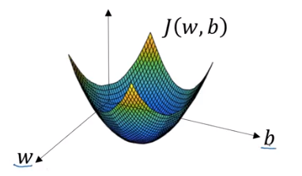
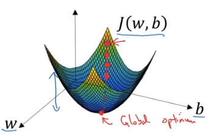
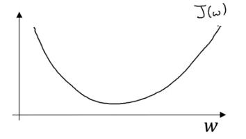
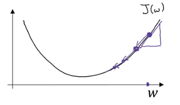
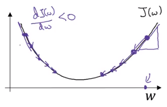
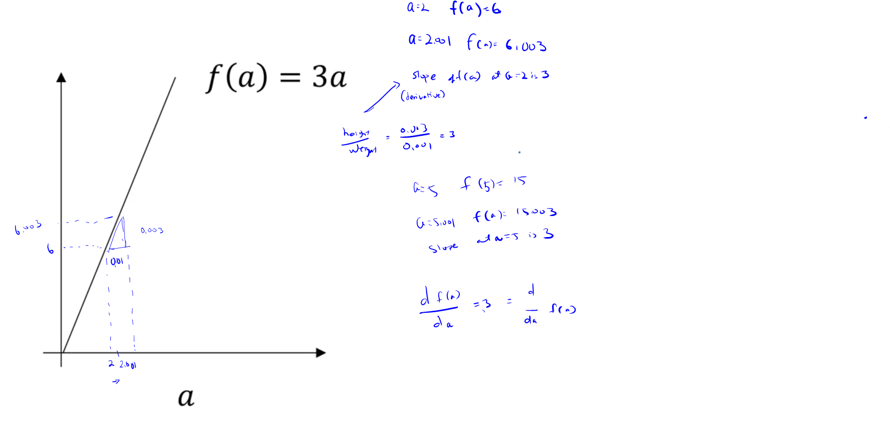
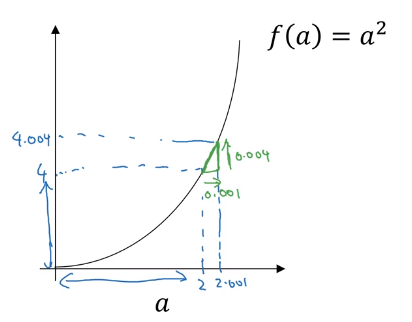

# Gradient Descent

<!-- TOC depthFrom:1 depthTo:6 withLinks:1 updateOnSave:1 orderedList:0 -->

- [Gradient Descent](#gradient-descent)
	- [Logistic Regression Recap](#logistic-regression-recap)
	- [Learning Rate](#learning-rate)
	- [　Actual Updates in gradient Descent](#actual-updates-in-gradient-descent)
- [Derivative](#derivative)
- [More Derivative Examples](#more-derivative-examples)
	- [Example 1](#example-1)
	- [Example 2](#example-2)
	- [Example 3](#example-3)
	- [Example 4](#example-4)
	- [Example 5](#example-5)

<!-- /TOC -->

## Logistic Regression Recap
* Logistic regression: $\hat{y}=\sigma{(w^T+b)}$, where $\sigma(z)=\frac{1}{1+e^{-z}}$
* Cost function: $J(w,b)=\frac{1}{m}(L(\hat{y},y))=-\frac{1}{m}(\sum^{m}_{i=1}[y\log\hat{y}^{(1)}+(1-y^{(i)})\log(1-\hat{y}^{(i)})])$

**Cost function** measures how well the parameters w and b are doing on the entire training set. The cost function has its own curve and its own gradients. The slope of this curve tells us how to update our parameters to make the model more accurate.

Want to find parameters w and b that minimize $J(w,b)$

Height is considered the **loss function**. $J(w,b)$ is a single convex.

To find a good value for the parameters, we initialize $w$ and $b$ to some initial value and for logistic regression usually you initialize the value to zero. Random initialization also works, but people don't usually do that for logistic regression. But because this function is convex, no matter where you initialize, you should get to the same point or roughly the same point. What **gradient descent** does is it starts at that initial point and then takes a step in the **steepest downhill direction**. So after one step of gradient descent you might end up there, because it's trying to take a step downhill in the direction of steepest descent or as quickly downhill as possible.

Gradient descent will bring the red dot to the global optimum.

Let's look gradient descent in 2 dimension space.

**Gradient descent repeats**

$w: w-\alpha\frac{dJ(w)}{dw}$ so $\frac{dJ(w)}{dw}$ is the **slope** of function

## Learning Rate
* $\alpha$ is a learning parameters. The size of these steps is called the learning rate. With a high learning rate we can cover more ground each step, but we risk overshooting the lowest point since the slope of the hill is constantly changing. With a very low learning rate, we can confidently move in the direction of the negative gradient since we are recalculating it so frequently. A low learning rate is more precise, but calculating the gradient is time-consuming, so it will take us a very long time to get to the bottom.
* $dw$ is the **derivative**. It is basically the update or the change you want to make to the parameters $w$.

When $\frac{dJ(w)}{dw}<0$, $w$ increases

## 　Actual Updates in gradient Descent

$J(w,b)$

$w:=w-\alpha\frac{dJ(w,b)}{dw}$  $\frac{\partial{J(w,b)}}{\partial{w}} \to dw$ $dw$ is used in the code

$b:=b-\alpha\frac{dj(w,b)}{db}$   $\frac{\partial{J(w,b)}}{\partial{b}} \to dw$

# Derivative

# More Derivative Examples

## Example 1
*  When $a=2$ then $f(a)=4$.

*  When $a=2.001$ then $f(a)\approx{4.004}$.

*  So a slope that is the derivative of $f(a)$ at $a=2$ is $4$. To write this out of our calculus notation, we say that $\frac{d}{da}f(a)=4$ when a=2 because we see that by nudging a up by .001, f(a) goes up 4 times as much.

## Example 2
* When $a=5$ then $f(a)=25$.

* When $a=5.001$ then $f(a)\approx{25.010}$.

* So a slope that is the derivative of $f(a)$ at $a=5$ is $25$. To write this out of our calculus notation, we say that $\frac{d}{da}f(a)=10$ when a=5 because f(a) goes 10 times as much.

Derivative: $\frac{d}{da}f(a)=\frac{d}{da}a^2=2a$

So, when you nudge by 0.001 upward, you will expect $f(a)$ to go up by $2a * 0.001$.

## Example 3
If $f(a)=a^2$ then the derivative $\frac{d}{da}=2a$ and if $a=2$, $f(a)=4$. If we nudge by 0.001, then $a=2.001$ and $f(a)\approx{4.004}$ so f(a) went upward by 4 times, and $2a=4$.

## Example 4
If $f(a)=a^3$ then the derivative $\frac{d}{da}=3a^2$ and if $a=2$, $f(a)=8$. If we nudge by 0.001, then $a=2.001$ and $f(a)\approx{8.012}$ so f(a) went upward by 12 times, and $3a^2=3*2^2=12$. So nudging by 0.001, it goes upward by $12*0.001=0.012$

## Example 5
If $f(a)=log_e(a)$  or $ln(a)$ then the derivative $\frac{d}{da}=\frac{1}{a}$ and if $a=2$, $f(a)/approx{0.69315}$. If we nudge by 0.001, then $a=2.001$ and $f(a)\approx{0.69365}$ so f(a) went upward by 0.0005, and $\frac{1}{a}=\frac{1}{2}$, so nudging by 0.001, it goes upward by half of 0.001 which is 0.0005.
