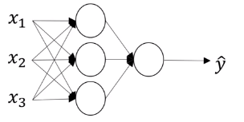
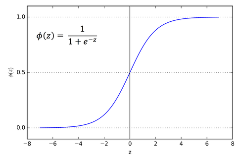
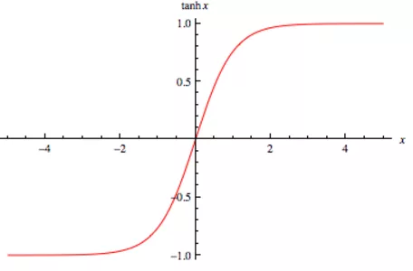
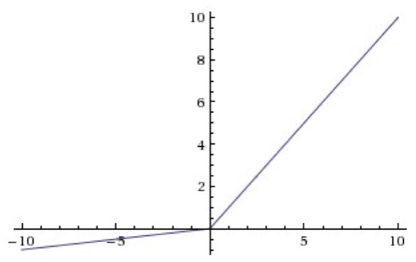

# Activation Functions (活性化関数)

## Sigmoid Activation Function (シグモイド関数)
Given x:

$z^{[1](i)}=w^{[1]}x^{(i)}+b^{[1]}$

$a^{[1](i)}=\sigma(z^{[1](i)})$

$z^{[2](i)}=w^{[2]}x^{(1)}+b^{[2]}$

$a^{[2](i)}=\sigma(z^{[2](i)})$

We used $\sigma$ function as an activation.

* The output is $0 <= \hat{y} <= 1$ so it can be used for binary classification.

$a=\frac{1}{1+e^{-z}}$

## Non Linear Activation Function

* $g$ could be a nonlinear function that may not be the sigmoid function.

$z^{[1](i)}=w^{[1]}x^{(i)}+b^{[1]}$

$a^{[1](i)}=g(z^{[1](i)})$

$z^{[2](i)}=w^{[2]}x^{(1)}+b^{[2]}$

$a^{[2](i)}=g(z^{[2](i)})$

## tanh Activation Function
1990年代になり、活性化関数は原点を通すべきと言う考えから、標準シグモイド関数よりもそれを線形変換した tanh の方が良いと提案された Yann LeCun; Leon Bottou; Genevieve B. Orr; Klaus-Robert Muller (1998). [Efficient BackProp](http://yann.lecun.com/exdb/publis/pdf/lecun-98b.pdf)

$a=tanh(z)=\frac{e^z-e^{-z}}{e^z+e^{-z}}$

* This is a shifted version of sigmoid function
* The curve crosses (0,0) and the values are between -1 and 1.
* The output is $-1 <= \hat{y} <= 1$ and the tanh function is almost always strictly superior.
* One of the **downsides** of both the sigmoid function and the tanh function is that if z is either very large or very small, then the gradient or the **derivative of this function becomes very small**.

## Rectify Linear Unit ランプ関数
Yann LeCun やジェフリー・ヒントンらが雑誌ネイチャーに書いた論文では、2015年5月現在これが最善であるとしている。 Yann LeCun; Yoshua Bengio; Geoffrey Hinton (May 28, 2015). “Deep learning”. Nature 521 (7553): 436-444. [doi:10.1038/nature14539](https://doi.org/10.1038%2Fnature14539)

$a=max(0,z)$

## Leaky Rectify Linear Unit ランプ関数

$a=max(0.01z, z)$

Andrew L. Maas; Awni Y. Hannun; Andrew Y. Ng (2013). [Rectifier Nonlinearities Improve Neural Network Acoustic Models](http://web.stanford.edu/~awni/papers/relu_hybrid_icml2013_final.pdf)
## Rules of Thumb

Activation function |Formula|Type of classification   |
--|---|---
$\sigma(z)$  | $\frac{1}{1+e^{-z}}$ |binary classification
$tanh(z)$  |  $\frac{e^{z}-e^{-z}}{e^{z}+e^{-z}}$
ReLU(z)  |max(0,z)|Default
Leaky ReLU(z)  |max(0.01z, z)|Works better than ReLU

* Your neural network will often learn much faster with ReLU and Leaky ReLU activation than when using the tanh or the sigmoid activation function
