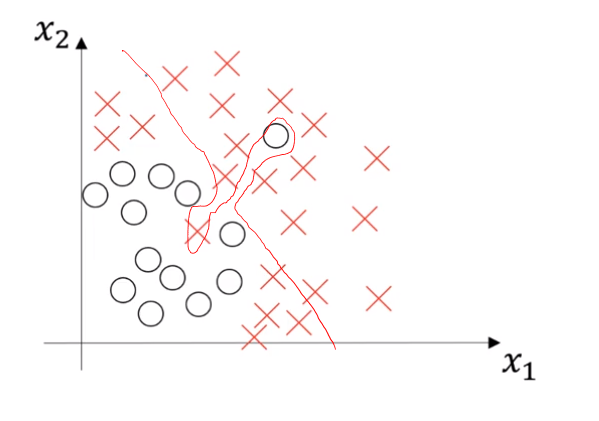

# Bias - Variance tradeoff

Of the changes you could make to most learning algorithms, there are some that reduce bias errors but at the cost of increasing variance, and vice versa. This creates a “trade off” between bias and variance.

For example, increasing the size of your model—adding neurons/layers in a neural network, or adding input features—generally reduces bias but could increase variance. Alternatively, adding regularization generally increases bias but reduces variance.

In the modern era, we often have access to plentiful data and can use very large neural networks (deep learning). Therefore, there is less of a tradeoff, and there are now more options for reducing bias without hurting variance, and vice versa.

For example, you can usually increase a neural network size and tune the regularization method to reduce bias without noticeably increasing variance. By adding training data, you can also usually reduce variance without affecting bias.

If you select a model architecture that is well suited for your task, you might also reduce bias and variance simultaneously. Selecting such an architecture can be difficult.

| data     | Over Fitting  | Under Fitting | Under Fitting            | Just Fit               |
| -------- | ------------- | ------------- | ------------------------ | ---------------------- |
| Training | 1%            | **15%**       | 15%                      | 0.5%                   |
| Dev      | **11%**       | 16%           | 30%                      | 1%                     |
|          | High Variance | High bias     | High bias, High Variance | Low bias, low Variance |

Based on assumption that human error is $\approx$ 0%

**$\color{red}{Optimal (Bayes) Error}$** $\approx$ 0 %

Training set would provide a sense of bias and Dev set would provide a sense of variance.

$\uparrow$ **High bias and high variance plot**

##  Why we compare to human-level performance

Many machine learning systems aim to automate things that humans do well. Examples include image recognition, speech recognition, and email spam classification. Learning algorithms have also improved so much that we are now surpassing human-level performance on more and more of these tasks.  
Further, there are several reasons building an ML system is easier if you are trying to do a task that people can do well:

1. **Ease of obtaining data from human labelers.​** For example, since people recognize cat images well, it is straightforward for people to provide high accuracy labels for your learning algorithm.
2. **Error analysis can draw on human intuition**​.  Suppose a speech recognition algorithm is doing worse than human-level recognition. Say it incorrectly transcribes an audio clip as “This recipe calls for a ​pear
​ of apples,” mistaking “pair” for “pear.” You can draw on human intuition and try to understand what information a person uses to get the correct transcription, and use this knowledge to modify the learning algorithm.
3. **Use human-level performance to estimate the optimal error rate and also set a “desired error rate**​.” Suppose your algorithm achieves 10% error on a task, but a person achieves 2% error. Then we know that the optimal error rate is 2% or lower and the avoidable bias is at least 8%. Thus, you should try bias-reducing techniques.
Even though item #3 might not sound important, I find that having a reasonable and achievable target error rate helps accelerate a team’s progress. Knowing your algorithm has high avoidable bias is incredibly valuable and opens up a menu of options to try.
There are some tasks that even humans aren’t good at. For example, picking a book to recommend to you; or picking an ad to show a user on a website; or predicting the stock market. Computers already surpass the performance of most people on these tasks. With these applications, we run into the following problems:
  - **It is harder to obtain labels**.​ For example, it’s hard for human labelers to annotate a database of users with the “optimal” book recommendation. If you operate a website or app that sells books, you can obtain data by showing books to users and seeing what they buy. If you do not operate such a site, you need to find more creative ways to get data.
  - **Human intuition is harder to count on.**​ For example, pretty much no one can predict the stock market. So if our stock prediction algorithm does no better than random guessing, it is hard to figure out how to improve it.
  - **It is hard to know what the optimal error rate and reasonable desired error rate is.** ​Suppose you already have a book recommendation system that is doing quite well. How do you know how much more it can improve without a human baseline?
