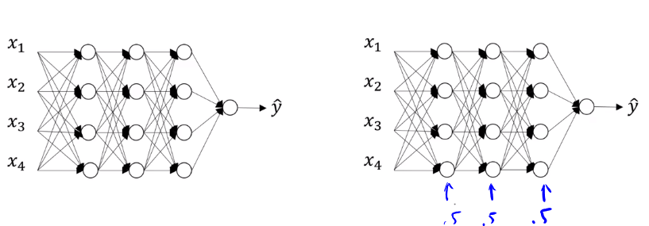

# Dropout regularization

Dropout is a regularization technique for neural network models proposed by Srivastava, et al. in their 2014 paper [Dropout: A Simple Way to Prevent Neural Networks from Overfitting](http://jmlr.org/papers/volume15/srivastava14a/srivastava14a.pdf)

Dropout is a technique where randomly selected neurons are ignored during training. They are “dropped-out” randomly. This means that their contribution to the activation of downstream neurons is temporally removed on the forward pass and any weight updates are not applied to the neuron on the backward pass.

As a neural network learns, neuron weights settle into their context within the network. Weights of neurons are tuned for specific features providing some specialization. Neighboring neurons become to rely on this specialization, which if taken too far can result in a fragile model too specialized to the training data. This reliant on context for a neuron during training is referred to complex co-adaptations.

You can imagine that if neurons are randomly dropped out of the network during training, that other neurons will have to step in and handle the representation required to make predictions for the missing neurons. This is believed to result in multiple independent internal representations being learned by the network.

The effect is that the network becomes less sensitive to the specific weights of neurons. This in turn results in a network that is capable of better generalization and is less likely to overfit the training data.

**Example with keep_prob=0.5**


:arrow_right: 0.5 probability to retain or **drop nodes** from each layer **for each training example**.


:arrow_right: Drop nodes at probability of 0.5 and **remove edges** to make a smaller neural network for each training example.

## How to you implement dropout regularization?

### Inverted Dropout

Illustration with layer $l$=3 and keep_prob=$0.8$

d3: dropout vector of layer 3
keep_prob: probability to keep the nodes

```Python
keep_prob=0.8
d3=np.random.rand(a3.shape[0], a3.shape[1])<keep_prob
a3=np.multiply(a3, d3) #element wise multiplication
a3 /= keep_prob # divide a3 with keep_prob
```

When a3 is (50,1) matrix, then 10 units will be shut off.
$z^{[4]}=W^{[4]}a^{[3]}+b^{[4]}$ and $a^{[3]}$ is reduced by 20%, so $a^{[3]}$ has to be divided up by 80%

## Do not dropout at test times

$a^{[0]}=X$

**No Dropout**

$z^{[1]}=W^{[1]}a^{[0]}+b^{[1]}$

$a^{[1]}=g^{[1]}(z^{[1]})$

$z^{[2]}=W^{[2]}a^{[1]}+b^{[2]}$

$a^{[2]}=g^{[2]}(z^{[2]})$

$\vdots$

$\hat{y}$

## Why does inverse dropout work?
**First Intuition:** if on every iteration you're working with a smaller neural network, and so using a smaller neural network seems like it should have a regularizing effect

**Second Intuition:** Can't rely on any one feature, so have to spread out weights. $\leftarrow$ Shrinks Weights - it has similar effect as L2 regularization


Lower keep-prob should be applied to the larger matrix, and higher keep-prob should be applied to the layers that do not ovefit the model.

#### Downside of dropout
Cost function of J is not well defined, so harder to evaluate the performance.
