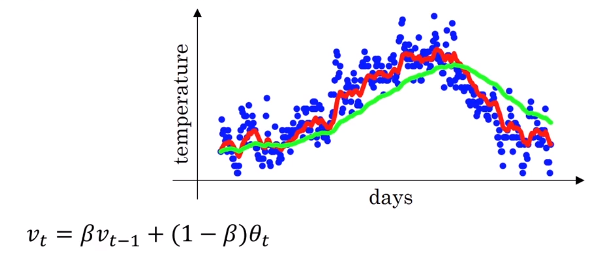

# Bias correction in exponentially weighted averages

Biased correction can make the computation of these averages more accurately.

When $\beta=0.98$, the purple line starts at low value. How can we fix that?

$v_0=0$ and $v_1=40$

$v_1=0.98*v_0+0.02*v_1=0.02*v_1=8$

$v_2=0.98*v_1+0.02*v_2=0.156*0.02*v_2$

so $v_1$ and $v_2$ are not good estimate and there is a method to compute more better estimate.

$\frac{v_t}{1-\beta^t}$

when $t=2$ then $1-\beta^t=0.0396$

$\frac{v_2}{0.0396}=\frac{0.0196*\theta_1 + 0.02*\theta_2}{0.0396}$ This bias correction works better at the intial stage
