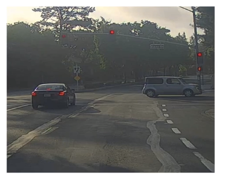
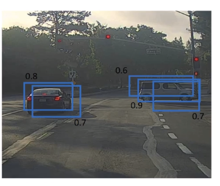
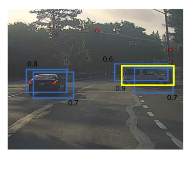
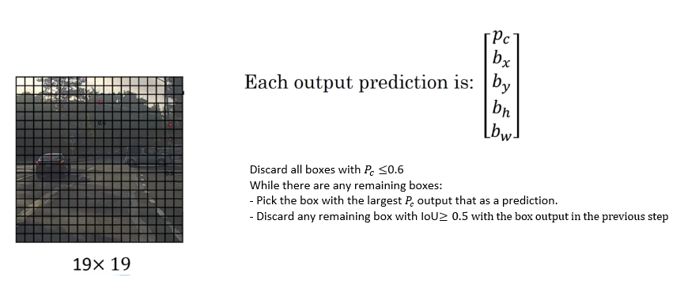

# Non-max Suppression

One of the problems of Object Detection so far, is that the algorithm may find multiple detections of the same objects. Rather than detecting an object just once, it might detect it multiple times. Non-max suppression is a way for you to make sure that your algorithm detects each object only once.

Example:
Let's say we want to detect pedestrians, cars, and motorcycles in this image.

You might place a grid over this, and this is a 19 by 19 grid. While technically this car has just one midpoint, so it should be assigned just one grid cell.

 In practice, we run an object classification and localization algorithm for every one of these split cells. So it's possible what we end up with multiple midpoints.

With a smaller grid cells, the probability of $P_c=1$ is high and we might end up with multiple detections of each object. Non-max suppresion will cleanup this problem.

## Steps of non-max Suppression

1. Compute the probability of detection (like $P_c\times c_1 \times c_2 \times c_3$)
2. Then takes the largest bounding box (0.9 in the figure below) with respect to the probability.

3. Then compute [IoU](https://stomioka.github.io/deeplearning/docs/098-intersection-over-union.html) with respect to other bounding boxex.
4. If the [IoU](https://stomioka.github.io/deeplearning/docs/098-intersection-over-union.html) is large then other bounding boxes (0.6 and 0.7 in the figure above) are suppressed.

Non-max suppression Algorithms

