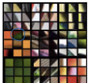
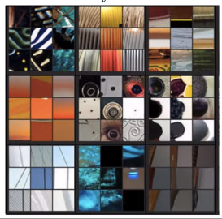
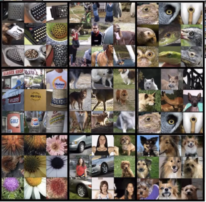

# Neural Style Transfer

# Deep ConvNets learning

Pick a unit in layer 1. Find the nine image patches that maximize the unit's activation.
In other words, pause your training set through your neural network, and figure out what is the image that maximizes that particular unit's activation. Now, notice that a hidden unit in layer 1, will see only a relatively small portion of the neural network. And so if you visualize, if you plot what activated unit's activation, it makes sense to plot just a small image patches, because all of the image that that particular unit sees. So if you pick one hidden unit and find the nine input images that maximizes that unit's activation, you might find nine image patches like this.

So looks like that in the lower region of an image that this particular hidden unit sees, it's looking for an egde or a line that looks like that. So those are the nine image patches that maximally activate one hidden unit's activation.

Repeat for other units.

## Visualizing deep layers

#### Layer 1

#### Layer 2 - detecting more detail features

#### Layer 3

### Layer 4

### Layer 5

## Cost Function

$\mathcal{J}(G)=\alpha\mathcal{J}_{content}(C,G)+\beta\mathcal{J}_{style}(C,G)$

$\mathcal{J}_{content}(C,G)$ measures how similar the content are between C and G.
$\mathcal{J}_{style}(S,G)$ measures how similar the style are between S and G.

After defining the cost,

1. Initiate G randomly
  - G: 100x100x3
2. Use gradient descent to minimize $\mathcal{J}(G)$
$G:=G-\frac{\partial \mathcal{J}(G)}{\partial G}$

## Content Cost Function
$\mathcal{J}(G)=\alpha\mathcal{J}_{content}(C,G)+\beta\mathcal{J}_{style}(C,G)$

# Reference
Zeiler & Fergus. (2013). [Visualizing and Understanding Convolutional Networks](https://arxiv.org/abs/1311.2901), arXiv 1311.2901
Leon A. Gatys, Alexander S. Ecker, Matthias Bethge. (2015). [A Neural Algorithm of Artistic Style](https://arxiv.org/abs/1508.06576), 	arXiv:1508.06576
