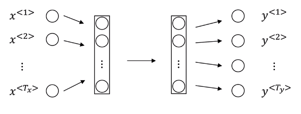
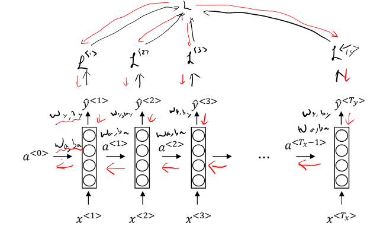
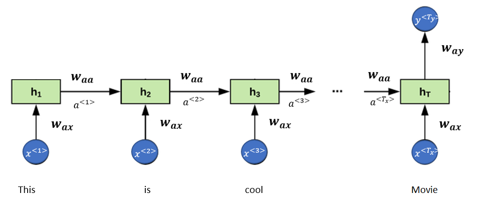
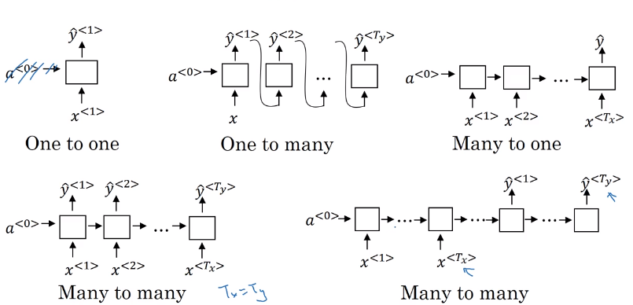

#Recurrent Neural Network Model

## Why not a standard model?

Problems:

Inputs, outputs can be different lengths in different examples.

Doesnt share fearues learned across different positions of text

## RNN

parameters are shared

One weakness of this RNN is that it only uses the information that is earlier in the sequence to make a prediction.

* Start with $a^{<0>}=\vec{0}$

* $a^{<1>}=g(W_{aa}a^{<0>}+W_{ax}x^{<1>}+b_a)$

* $\hat{y}^{<1>}=g(W_{ya}a^{<1>}++b_y)$

$a\rightarrow  W_{ax}X^{<1>}$ 
The second index $x$ means that this $W_{ax}$ is going to be multiplied by some $X$-like quantity, and The first index $a$ means that this is used to compute some $a$-like quantity

$W_{ya}$ is multiplied by some $a$ like quantity to compute a $y$ type quantity.

In RNN, tanh is very common choice. ReLu is sometimes used.

In generalized way
* $a^{<t>}=g(W_{aa}a^{<t-1>}+W_{ax}x^{<t>}+b_a)$

* $\hat{y}^{<1>}=g(W_{ya}a^{<t>}+b_y)$ g will depends on what y as usual

This can be rewritten as:
* $a^{<t>}=g(W_{a}[a^{<t-1>},x^{<t>}]+b_a)$
* $W_a=[W_{aa} W_{ax}]$

 If $a$ was a 100 dimensional, and $x$ was 10,000 dimensional, then $W_{aa}$ would have been a 100 by 100 dimensional matrix, and  $W_{ax}$ would have been a 100 by 10,000 dimensional matrix.
 

 $[a^{<t-1>},x^{<t>}]$=$\begin{bmatrix}
a^{<t-1>}\\
x^{<t>}
 \end{bmatrix}$

 

 ## Backpropagation through time
 ### Forward and backword Propagation
 
Backpropagation through time

 **Loss Function**
 $\mathcal{L}^{<t>}(\hat{y}^{<t>},y^{<t>})=-y^{<t>}\log \hat{y}^{<t>}-(1-y^{<t>})\log (1-\hat{y}^{<t>})$

 **Overall loss of sequence**

 $\mathcal{L}(\hat{y},y)=\sum_{t=1}^{T_x}\mathcal{L}^{<t>}(\hat{y}^{<t>},y^{<t>})$

 ## Different types of RNN
 Andrej Karpathy http://karpathy.github.io/2015/05/21/rnn-effectiveness/

 ### Many to Many Architecture

 

 ### Many to One Architecture

 Use case: Sentence Classification

 

 ### One to Many Architecture
 Use case: Music generalizations

 

 ### Other many to many architecture
Translation

