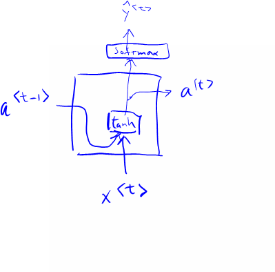
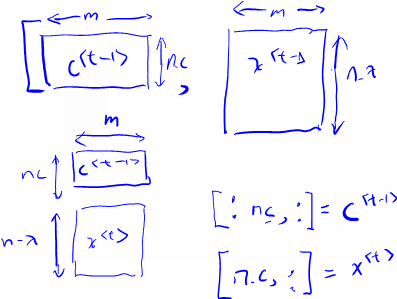
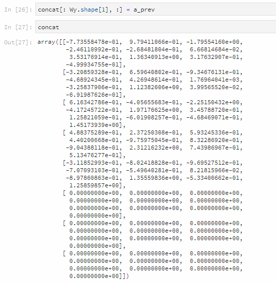
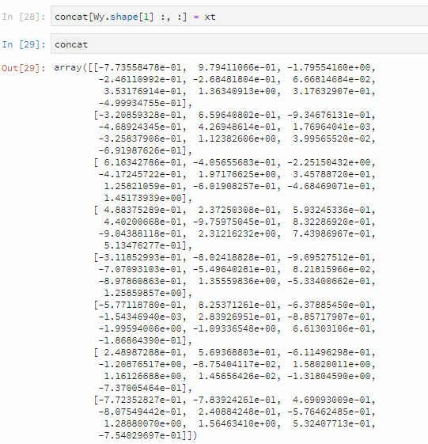
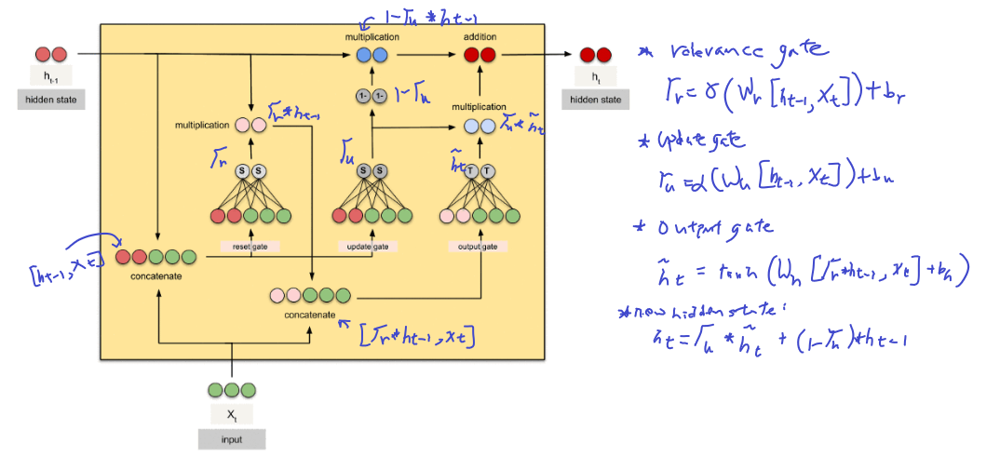

#Gated Recurrent unit



$a^{<0>}=g(W_a[a^{<t-1>}, x{<t>}]+b_a)$

**New parameter: c --- memory cell**

$c^{<t>}$=$a^{<t>}$ in GRU

$\tilde{c}^{<t>}=tanh(W_c[c^{<t-1>}, x^{<t>}]+b_c)$ is **to update $c^{<t>}$**

* $[c^{<t-1>}, x^{<t>}]$ means concatenate $c^{\langle t-1 \rangle}$ and $x^{\langle t \rangle}$ in a single matrix: $concat = \begin{bmatrix} c^{\langle t-1 \rangle} \\ x^{\langle t \rangle} \end{bmatrix}$





**Gate** u stands for update gate

$\Gamma{u}=\sigma(W_u[c^{<t-1>}, x^{<t>}]+b_u)$ is **to decide whether or not to update $c^{<t>}$**

Suppose we are working on this sentence.


Adverse events are recorded in textual or ‘verbatim’ terms <eos>

$c^{<t>}$ is set to 0 for example to indicate that 'events' is plural. 'are' is also set to 0, until $\Gamma{u}$ make decision whether or not to update 'events'


So this can be expressed as
$c^{<t>}=\Gamma{u}*\tilde{c}^{<t>}+(1-\Gamma{u})*\tilde{c}^{<t-1>}$


## Full GRU
**candidate value for a new memory cell**

$\tilde{c}^{<t>}=tanh(W_c[\Gamma{r}*c^{<t-1>}, x^{<t>}]+b_c)$

$\Gamma{r}=\sigma(W_r[c^{<t-1>}, x^{<t>}]+b_r)$
 is to indicate how $c^{<t-1>}$ is relevant
```python
concat = np.zeros([xt.shape[0]+Wy.shape[1],xt.shape[1]])
concat[: n_a, :] = a_prev
concat[n_a :, :] = xt
relevance_gate=sigmoid(np.dot(Wr,concat)+br)
```
$\Gamma{u}=\sigma(W_u[c^{<t-1>}, x^{<t>}]+b_u)$

$c^{<t>}=\Gamma{u}*\tilde{c}^{<t>}+(1-\Gamma{u})*{c}^{<t-1>}$



Original image from [here](https://cdn-images-1.medium.com/max/800/1*FpRS0C3EHQnELVaWRvb8bg.gif) before annotation

In motion

