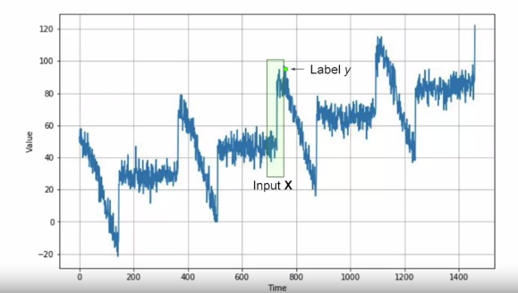

# Feeding windowed dataset into neural networks



This  will take in a data series along with the parameters for the size of the window that we want. The size of the batches to use when training, and the size of the shuffle buffer, which determines how the data will be shuffled.

The first step will be to create a dataset from the series using a tf.data dataset. And we'll pass the series to it using its from_tensor_slices method. We will then use the window method of the dataset based on our window_size to slice the data up into the appropriate windows. Each one being shifted by one time set. We'll keep them all the same size by setting drop remainder to true.

We then flatten the data out to make it easier to work with. And it will be flattened into chunks in the size of our window_size + 1.

Once it's flattened, it's easy to shuffle it. You call a shuffle and you pass it the shuffle buffer. Using a shuffle buffer speeds things up a bit.

So for example, if you have 100,000 items in your dataset, but you set the buffer to a thousand. It will just fill the buffer with the first thousand elements, pick one of them at random. And then it will replace that with the 1,000 and first element before randomly picking again, and so on. This way with super large datasets, the random element choosing can choose from a smaller number which effectively speeds things up.

The shuffled dataset is then split into the xs, which is all of the elements except the last, and the y which is the last element.

It's then batched into the selected batch size and returned.

```python
def windowed_dataset(series, window_size, brach_size, shuffle_buffer):
  dataset = tf.data.Dataset.from_tensor_slices(series)
  dataset = dataset.window(window_size +1, shift=1, drop_remainder=True)
  dataset = dataset.flat_map(lambda x: x.batch(window_size +1))
  dataset = dataset.shuffle(buffer_size=shuffle_buffer).map(lambda x: (x[:-1], x[-1:]))
  dataset = dataset.batch(brach_size).prefetch(1)
```
