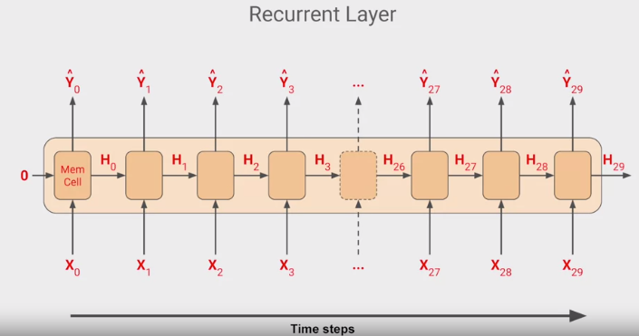
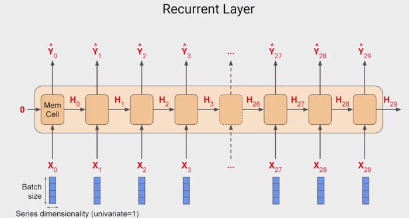
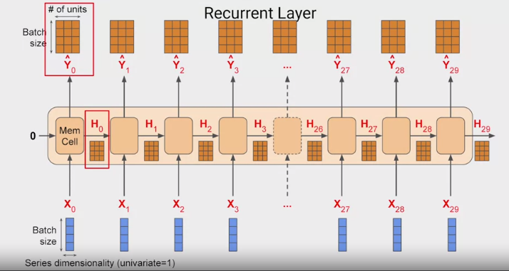
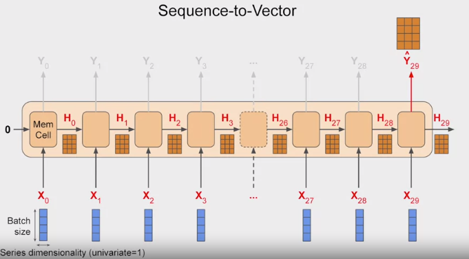
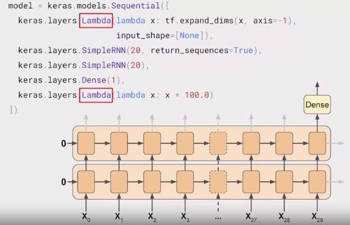
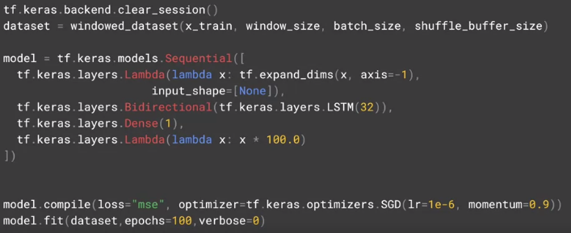
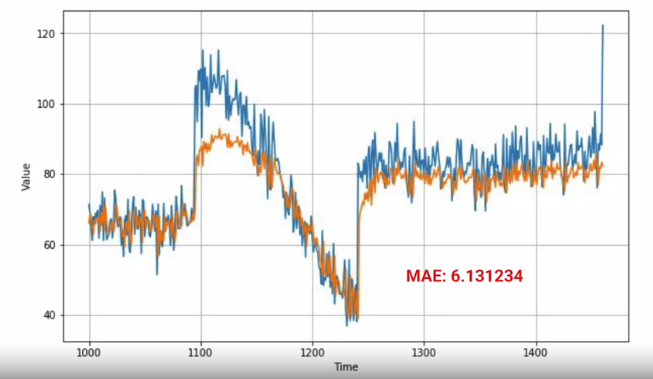
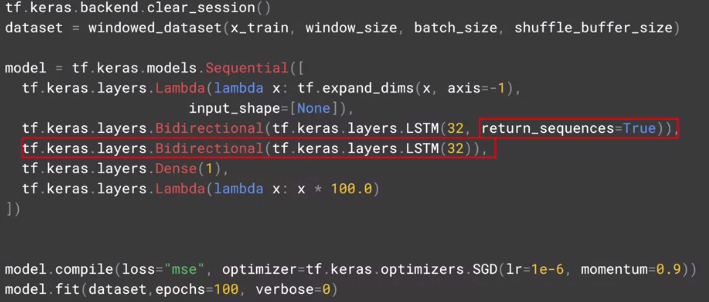
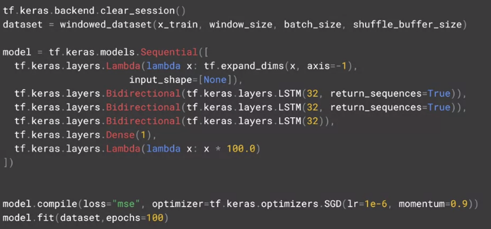
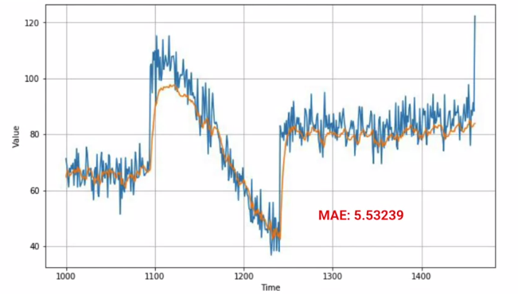

RNN for time series

## Conceptual Overview
A Recurrent Neural Network, or RNN is a neural network that contains recurrent layers. These are designed to sequentially processes sequence of inputs. RNNs are pretty flexible, able to process all kinds of sequences.


They could've been used for predicting text. Here we'll use them to process the time series. This example, will build an RNN that contains two recurrent layers and a final dense layer, which will serve as the output. With an RNN, you can feed it in batches of sequences, and it will output a batch of forecasts. The full input shape when using RNNs is 3-dimensional.

The first dimension will be the **batch size**, the second will be the **timestamps**, and the third is the **dimensionality of the inputs at each time step**.

For example, if it's a univariate time series, this value will be one, for multivariate it'll be more. The DNN model had two-dimensional inputs, the batch dimension was the first, and the second had all the input features.



There's only one cell, and it's used repeatedly to compute the outputs. In this diagram, the same one being reused multiple times by the layer. At each time step, the memory cell takes the input value for that step. For example, it is zero at time zero, and zero state input. It then calculates the output for that step, in this case `Y0`, and a state vector `H0` that's fed into the next step. `H0` is fed into the cell with `X1` to produce `Y1` and `H1`, which is then fed into the cell at the next step with `X2` to produce `Y2` and `H2`. These steps will continue until we reach the end of our input dimension, which in this case has 30 values. Now, this is what gives this type of architecture the name a recurrent neural network, because the values recur due to the output of the cell, a one-step being fed back into itself at the next time step.

This is really helpful in determining states. The location of a word in a sentence can determine it semantics. Similarly, for numeric series, things such as closer numbers in the series might have a greater impact than those further away from our target value.

## Shape of the ihnputs to the RNN

 The inputs are three dimensional.



 For example, if we have a window size of 30 timestamps and we're batching them in sizes of four, the shape will be 4 times 30 times 1, and each timestamp, the memory cell input will be a four by one matrix. The cell will also take the input of the state matrix from the previous step. But of course in this case, in the first step, this will be zero. For subsequent ones, it'll be the output from the memory cell. But other than the state vector, the cell will output a `Y` value as shown below.


 If the memory cell is comprised of three neurons, then the output matrix will be $4\times3$ because the batch size coming in was $4$ and the number of neurons is $3$. So the full output of the layer is $3$ dimensional, in this case, $4\times30\times3$. With $4$ being **the batch size**, $3$ being **the number of units**, and $30$ being **the number of overall steps**.

 In a simple RNN, the state output `H` is just a copy of the output matrix `Y`. So for example, `H_0` is a copy of `Y_0`, `H_1` is a copy of `Y_1`, and so on. So at each timestamp, the memory cell gets both the current input and also the previous output.



 Now, in some cases, we might want to input a sequence, but you we't want to output on and you just want to get a single vector for each instance in the batch. This is typically called a **sequence to vector RNN**.



 But in reality, all we do is ignore all of the outputs, except the last one. When using Keras in TensorFlow, this is the default behavior. So if we want the recurrent layer to output a sequence, you have to specify `returns_sequences=True` when creating the layer. We need to do this when you stack one RNN layer on top of another.

## Outputting a sequences
Consider this RNN, these has two recovered layers, and the first has `return_sequences=True` set up.


It will output a sequence which is fed to the next layer. The next layer does not have return_sequence that's set to True, so it will only output to the final step. But notice the `input_shape`, it's set to `None` and `1`. TensorFlow assumes that the first dimension is the **batch size**, and that it can have any size at all, so you don't need to define it.

Then the next dimension is **the number of timestamps**, which we can set to `None`, which means that the RNN can handle sequences of any length. The last dimension is just one because we're using a univariate time series.

This two-layer RNN that has the second one not return sequences will give us an output to a single dense.


If we set `return_sequences` to `true` and all recurrent layers, then they will all output sequences and the dense layer will get a sequence as its inputs. Keras handles this by using the same dense layer independently at each time stamp.

It might look like multiple ones here but it's the same one that's being reused at each time step. This gives us what is called a sequence to sequence RNN. It's fed a batch of sequences and it returns a batch of sequences of the same length. The dimensionality may not always match. It depends on the number of units in the memory sale.

## Lambda layers



 The type of layer that use the Lambda type is one that allows us to perform arbitrary operations to effectively expand the functionality of TensorFlow's kares, and we can do this within the model definition itself. The first Lambda layer will be used to help us with our dimensionality.

 The timeseries data often comes as a 2 dimentional shape with the first being the batch size and the second the number of timestamps. But an RNN expects three-dimensions; batch size, the number of timestamps, and the series dimensionality. With the Lambda layer, we can fix this. Using the Lambda, we just expand the array by one dimension. **By setting input shape to none, we're saying that the model can take sequences of any length.** Similarly, if we scale up the outputs by 100, we can help training. The default activation function in the RNN layers is tan H which is the hyperbolic tangent activation.  This outputs values between negative one and one.

 Since the time series values are in that order usually in the 10s like 40s, 50s, 60s, and 70s, then scaling up the outputs to the same ballpark can help us with learning.

 ## Coding LSTMs



First of all is the `tf.keras.backend.clear_session`, and this clears any internal variables. That makes it easy for us to experiment without models impacting later versions of themselves.

Results:


Adding one more layer of LSTM




Adding third layer of LSTM





## Example of code
```python

```
```python

```
```python

```
```python

```
```python

```
```python

```
```python

```
```python

```
```python

```
```python

```
```python

```
```python

```
